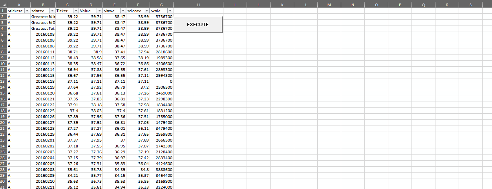

# Automatic Stock Analysis with VBA 
## 1. Background
Excel spreadsheet is an excellent tool to store and perform a variety of data analysis types. However, when the dataset becomes so large, it's challenging to perform manual calculation efficiently. Thanks to the built-in Visual Basic for Applications, data automation is made possible to analyze data in a extensive workbook as the one in this project, where there are 2.3 millions rows of records. A button to activate VBA is added on the spreadsheet for user convience, and there is also a pop up message to notify user when the analysis is done (it could take up to 3 minutes to get results from 2.3 millions records).

## 2. Objective
In this project, the objective is to quickly analyze stock market data of all three years and provide two summary tables that include:
* **Table 1:**
  * Stock Tickers (Symbols)
  * Yearly Change (opening price vs. closing price of same year)
  * Percentage Yearly Change
  * Total Stock Volumes
* **Table 2:**
  * Stock Ticker (Symbol) that has the greatest % increase in that year
  * Stock Ticker (Symbol) that has the greatest % decrease in that year
  * Stock Ticker (Symbol) that has greatest total volumes

### 3. Quick Overview of Main Steps (pseudo codes):
  * Looping through all spreadsheets inside the workbook.
  * In each spreadsheet, looping through every rows, store data and compute gains/ losses of each stock.
  * Outputing both summary tables on the right side of the original data by setting the reference "coordinates" and use `.Offset()` function to create output columns and rows.
  * Building `If` statement to avoid "zero-division" and group all same stock records into one row in the summary table.
  * Color-coding to quickly identify positive gains in green and negative losses in red.

## 4. Tools/ Techniques/ Technologies
* Languages:
  * VBA
* Software:
  * Visual Studio Code
  * VBA Console
  * Microsoft Excel
* Operating System:
  * Windows 10 Pro v.1909

## 5. File Structure/ Table of Contents
* **Exported Source Code:** because the stock workbook is quite heavy, VBA source codes were exported and saved in this folder for user to download without having to download a fairly large data.
* **Images:** screenshots of output tables in each year upon script running completion.
* **Testing File:** during developement and testing, a smaller dataset was used to debug the code more efficiently. The testing dataset was saved in this folder.
* **Stock_Analysis.xlsm:** this is the main dataset and was successfully ran with source codes developed.
